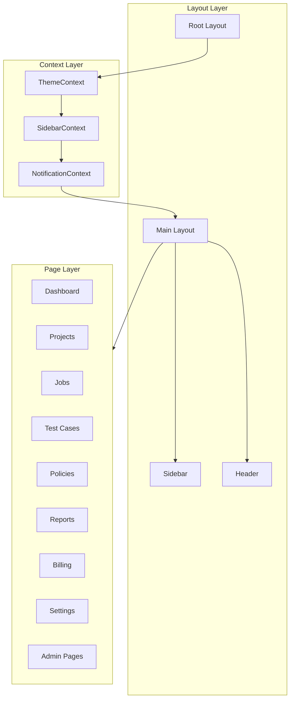

# Product Requirements Document (PRD) - AI Validate Compliance Platform

## 1. Executive Summary

**Product Name:** AI Validate - Enterprise AI Compliance Platform

**Version:** 1.0.0

**Platform:** Web (React SPA with React Router v7)

**Target Users:** Enterprise organizations requiring AI regulatory compliance testing

AI Validate is a multi-tenant enterprise platform for regulatory compliance testing of AI systems. The platform enables organizations to validate their AI systems against regulatory frameworks (EU AI Act) through configurable test cases, automated job execution, and comprehensive compliance reporting.

---

## 2. Technology Stack

### Core Framework

| Technology | Version | Purpose |
|------------|---------|---------|
| React | 19.x | UI Framework |
| Vite | 7.x | Build Tool & Dev Server |
| React Router | 7.x | Routing (Framework Mode) |
| TypeScript | 5.x | Type Safety |
| Tailwind CSS | 4.x | Styling |

### Additional Dependencies (To Install)

```bash
npm install @headlessui/react lucide-react recharts react-hook-form zod @hookform/resolvers
```

| Package | Purpose |
|---------|---------|
| `@headlessui/react` | Accessible UI primitives (modals, dropdowns, tabs) |
| `lucide-react` | Tree-shakeable icon library |
| `recharts` | Charting library for analytics |
| `react-hook-form` | Performant form handling |
| `zod` | Schema validation |
| `@hookform/resolvers` | Zod integration with react-hook-form |

### Already Installed

- `clsx` + `tailwind-merge` - Conditional class merging
- `dayjs` - Date formatting
- `use-debounce` - Debounced search (500ms)

---

## 3. Architecture

### 3.1 Folder Structure

```
frontend/
├── app/
│   ├── components/           # Reusable UI components
│   │   ├── ui/              # Base UI primitives
│   │   │   ├── Button.tsx
│   │   │   ├── Input.tsx
│   │   │   ├── Select.tsx
│   │   │   ├── Modal.tsx
│   │   │   ├── Table.tsx
│   │   │   ├── Card.tsx
│   │   │   ├── Badge.tsx
│   │   │   ├── Tabs.tsx
│   │   │   ├── Toggle.tsx
│   │   │   └── ProgressBar.tsx
│   │   ├── layout/          # Layout components
│   │   │   ├── Sidebar.tsx
│   │   │   ├── Header.tsx
│   │   │   ├── MainLayout.tsx
│   │   │   └── PageHeader.tsx
│   │   ├── charts/          # Chart components
│   │   │   ├── BarChart.tsx
│   │   │   ├── LineChart.tsx
│   │   │   └── DonutChart.tsx
│   │   └── shared/          # Shared domain components
│   │       ├── StatCard.tsx
│   │       ├── RiskBadge.tsx
│   │       ├── StatusBadge.tsx
│   │       └── SearchInput.tsx
│   ├── contexts/            # React contexts
│   │   ├── ThemeContext.tsx
│   │   ├── SidebarContext.tsx
│   │   └── NotificationContext.tsx
│   ├── hooks/               # Custom hooks
│   │   ├── useTheme.ts
│   │   ├── useSidebar.ts
│   │   ├── useNotifications.ts
│   │   └── useLocalStorage.ts
│   ├── lib/                 # Utilities
│   │   ├── cn.ts            # clsx + tailwind-merge
│   │   ├── constants.ts     # App constants
│   │   └── formatters.ts    # Date, number formatters
│   ├── data/                # Mock data (backend placeholders)
│   │   ├── dashboard.ts
│   │   ├── projects.ts
│   │   ├── jobs.ts
│   │   ├── testCases.ts
│   │   ├── policies.ts
│   │   ├── reports.ts
│   │   ├── billing.ts
│   │   └── analytics.ts
│   ├── types/               # TypeScript types
│   │   └── index.ts
│   ├── routes/              # Route components
│   │   ├── _index.tsx       # Dashboard (/)
│   │   ├── projects/
│   │   │   ├── _index.tsx   # /projects
│   │   │   └── $projectId.tsx
│   │   ├── jobs/
│   │   │   ├── _index.tsx   # /jobs
│   │   │   └── create.tsx
│   │   ├── test-cases.tsx   # /test-cases
│   │   ├── policies.tsx     # /policies
│   │   ├── reports.tsx      # /reports
│   │   ├── billing.tsx      # /billing
│   │   ├── settings.tsx     # /settings
│   │   └── admin/
│   │       ├── test-cases.tsx    # /admin/test-cases
│   │       ├── policies.tsx      # /admin/policies
│   │       ├── tenants.tsx       # /admin/tenants
│   │       └── analytics.tsx     # /admin/analytics
│   ├── routes.ts            # Route definitions
│   ├── root.tsx             # Root layout
│   └── app.css              # Global styles
├── public/
└── package.json
```

### 3.2 Component Architecture



---

## 4. Route Structure

| Route | Component | Description |
|-------|-----------|-------------|
| `/` | Dashboard | Main overview with stats, recent jobs, risk summary |
| `/projects` | Projects | List all projects, create project |
| `/projects/:id` | ProjectDetail | Project details with jobs |
| `/jobs` | Jobs | List all jobs, filter by status |
| `/jobs/create` | CreateJob | Job creation flow |
| `/test-cases` | TestCases | Browse EU AI Act test cases |
| `/policies` | Policies | View policy documents |
| `/reports` | Reports | Generate and download reports |
| `/billing` | Billing | Credits balance and transactions |
| `/settings` | Settings | Profile, API Keys, Notifications, Security tabs |
| `/admin/test-cases` | AdminTestCases | Manage test cases (Admin) |
| `/admin/policies` | AdminPolicies | Upload and manage policies (Admin) |
| `/admin/tenants` | AdminTenants | User management (Admin) |
| `/admin/analytics` | AdminAnalytics | Usage analytics with charts (Admin) |

---

## 5. Global Features

### 5.1 Sidebar Navigation

- **Collapsible**: Toggle button in header
- **Close Button**: On mobile, an X button appears at the top right of the sidebar header for closing
- **Scrollable**: Overflow-y-auto for long content
- **Sections**: MAIN, BILLING, ADMIN (dropdown)
- **Admin Dropdown**: Contains Test Case Management, Policy Management, User Management, Usage Analytics
- **Active State**: Highlighted based on current route
- **Fixed Position**: Always visible, 256px width (w-64)

### 5.2 Header

- **Sidebar Toggle**: Menu button to collapse/expand sidebar
- **Tenant Selector**: "DE | DEFAULT" dropdown (UI only for now)
- **Global Search**: Debounced search (500ms) using `use-debounce`
- **Theme Toggle**: Light/Dark mode switch
- **Notifications**: Bell icon with badge count
- **User Profile**: Display "Tenant Admin" (not email), avatar with initials

### 5.3 Theme System

- **Light Mode**: Default on first open (always starts in light mode, ignores system preference)
- **Dark Mode**: Toggle via header button (dark/black backgrounds)
- **Persistence**: LocalStorage (remembers user's choice after first toggle)
- **Tailwind v4 Config**: Class-based dark mode via `@custom-variant dark (&:where(.dark, .dark *))` in `app.css`
- **Implementation**: ThemeContext adds/removes `dark` class on `<html>` element

### 5.4 Responsive Design

- **Mobile**: < 768px - Sidebar hidden, hamburger menu
- **Tablet**: 768px - 1024px - Sidebar collapsible
- **Desktop**: > 1024px - Full sidebar

### 5.5 Form Pattern

- All forms include **Cancel** button alongside primary action
- Form validation with Zod schemas
- React Hook Form for state management

### 5.6 Chart Components

Located in `app/components/charts/`:

**DonutChart (`DonutChart.tsx`):**
- Props: `data`, `height`, `innerRadius`, `outerRadius`, `colors`, `showLegend`, `showLabels`
- `showLabels={true}`: Renders external labels positioned outside chart segments
- Label format: "Name Value%" with color matching segment
- Uses trigonometry (RADIAN) to calculate label positions at 135% of outer radius
- Supports custom color arrays for segments
- Theme-aware tooltips (light/dark backgrounds)

**BarChart (`BarChart.tsx`):** Vertical bar charts for time-series data

**LineChart (`LineChart.tsx`):** Line charts with multiple data series

**HorizontalBarChart (`HorizontalBarChart.tsx`):** Horizontal bars for comparison data

---

## 6. Page Specifications

### 6.1 Dashboard (`/`)

**Header:** "Dashboard" with subtitle "AI Validation & Compliance overview"

**Action Buttons (in header, right-aligned):**

- "View Reports" (outline style, document icon) - Navigate to `/reports`
- "Create Job" (primary style, play icon) - Navigate to job creation flow

**Stats Cards (4 columns on desktop):**

1. Total Jobs Run: `1,284` - All time validations, +12% from last month
2. Jobs Completed: `1,156` - 90.0% success rate
3. Active Alerts: `7` - Requires attention (amber)
4. Credits Remaining: `4,250` - Est. 85 jobs remaining

**Recent Jobs Table:**

- Columns: Job Name, Project, Status, Risk, Tests (passed/total), Created
- Status badges: Completed (green), Running (blue), Failed (red), Pending (gray)
- Risk badges: Low Risk (green), Medium Risk (amber), High Risk (red)
- "View all" link to `/jobs`
- Show last 5 jobs

**Compliance Risk Summary:**

- Donut chart showing risk distribution
- Low Risk: 50%, Medium Risk: 28%, High Risk: 22%

### 6.2 Projects (`/projects`)

**Header:** "Projects" with "+ Create Project" button

**Search:** Debounced search for projects

**Table Columns:**

- Project (name + description)
- AI System Type (LLM, Multimodal)
- Status (Active, Draft)
- Jobs count
- Last Validation date
- Actions (more menu)

**Create Project Modal:**

- Project Name (text input)
- Description (textarea, optional)
- AI System Type (dropdown: LLM, Multimodal)
- Cancel + Save buttons

**Project Detail (`/projects/:id`):**

- Show project info (AI System Type, Status, Total Jobs)
- "+ Create Job" button - Opens multi-step modal:
  1. Step 1: Enter job name (project pre-selected)
  2. Step 2: Select regulation folder (EU AI ACT)
  3. Step 3: Select test cases with checkboxes, then Save
- List jobs within project with clickable job names
- **Job Detail View**: Click on job name or eye icon to view:
  - Job status, progress, risk level, credits
  - List of all selected test cases with name, description, complexity, modality
- "Execute Project" button to run all pending/failed jobs
- Execution feedback with success/status messages
- **Data Persistence**: All projects and jobs stored in localStorage

### 6.3 Jobs (`/jobs`)

**Header:** "Jobs" with "+ Create Job" button

**Filters:**

- Search input (debounced)
- Status dropdown: All Status, Pending, Running, Completed, Failed

**Table Columns:**

- Checkbox for selection
- Job (clickable name + project)
- Status
- Progress (progress bar + text)
- Risk
- Credits
- Created
- Actions (eye icon to view, more menu)

**Job Detail View Modal:**

- Click on job name or eye icon to view job details
- Shows: Project, Status, Progress, Risk Level, Credits, Created date
- Lists all selected test cases with name, description, complexity units, modality
- Close button to dismiss

**Data Persistence:**

- Jobs created in `/projects` appear in `/jobs` section
- All data stored in localStorage (`aivalidate_jobs` key)
- New jobs appear at the top of the list

**Create Job Flow:**

1. Select Project (dropdown) or enter new project name
2. Enter Job Name
3. Save to show regulation folders (EU AI ACT)
4. Navigate into folder to select test cases
5. Save selected test cases

**Execute Job:** Select job and click "Execute Job" button

### 6.4 Test Cases (`/test-cases`)

**Header:** "Test Cases" - Browse and select validation test cases

**Filters:**

- Search input
- Modality dropdown: All Modalities, Text, Image, Video
- Source dropdown: All Sources, default-admin, tenant-admin

**Table Columns:**

- Checkbox for selection
- Test Case (name + description)
- Source (badge)
- Modality (icon + text)
- Complexity (units)
- Tags
- Documents (EU AI Act link)
- Status (active, draft)

**Save Selection Flow:**

When test cases are selected, a "Save Selected (n)" button appears. Clicking it opens a modal:

1. **Project Selection:**
   - Radio buttons: "Existing Project" or "New Project"
   - Existing: Dropdown to select from saved projects
   - New: Text input to enter project name

2. **Job Selection:**
   - Radio buttons: "Existing Job" or "New Job"
   - Existing: Dropdown showing jobs in selected project (disabled if new project or no jobs exist)
   - New: Text input to enter job name

3. **Save Behavior:**
   - Creates new project if "New Project" selected
   - Creates new job with selected test cases, or merges test cases into existing job
   - Shows success message before closing
   - Clears selection after save

**Data Persistence:**

- Uses same localStorage keys as `/projects` and `/jobs`
- Saved projects/jobs immediately appear in other sections

### 6.5 Policies (`/policies`)

**Header:** "Policies & Compliance" with "Upload Policy" button

**Tabs:** Policy Documents, Knowledge Base, Article Mapping

**Policy Documents Tab:**

**Info Box:** Explanation of RAG processing for policy documents

**Search:** Debounced search for policies

**Table Columns:**

- Policy (name + description, icon)
- Version
- Status (Indexed, Processing)
- Articles count
- Uploaded date

**Knowledge Base Tab:**

- Title: "Knowledge Base" with subtitle "Indexed policy content available for validation"
- **6 Interactive Cards** in 3-column grid:
  1. **High-Risk AI Systems** - Blue icon (Shield), 15 indexed sections, EU AI Act
  2. **Prohibited Practices** - Red icon (Ban), 8 indexed sections, EU AI Act
  3. **Transparency Requirements** - Green icon (Eye), 12 indexed sections, EU AI Act
  4. **Data Governance** - Purple icon (Database), 6 indexed sections, Internal
  5. **Human Oversight** - Orange icon (Users), 9 indexed sections, EU AI Act
  6. **Bias & Fairness** - Teal icon (Scale), 11 indexed sections, Internal
- Card hover effects: border highlight, shadow, icon background changes to solid color

**Article Mapping Tab:**

- Title: "Article Mapping" with subtitle "View how test cases map to regulatory articles"
- Coming soon placeholder with:
  - Network/hub icon in circular container
  - "Article mapping visualization coming soon..." message
  - Description about interactive graph for compliance relationships
  - Dashed border container styling

**Upload Policy Modal:**

- Drag and drop zone for PDF/DOC
- Cancel + Upload buttons

### 6.6 Reports (`/reports`)

**Header:** "Reports" with "Generate Report" button

**Stats Cards (3 columns):**

1. Reports Generated: 47 this month
2. Audit Reports: 12 ready for review
3. Last Generated: 1d ago + report name

**Recent Reports Table:**

- Report name
- Type (Compliance, Audit, Summary badges)
- Project
- Generated date
- Size
- Action (Download PDF)

**Generate Report Modal:**

- Select Project (dropdown)
- Cancel + Generate buttons

### 6.7 Billing (`/billing`)

**Header:** "Credits & Billing" with "+ Purchase Credits" button

**Stats Cards (3 columns):**

1. Credits Balance: 4,250 (~85 validation jobs)
2. Used This Month: 1,750 (with progress bar)
3. Unit Price: $0.05 per complexity unit

**Transaction History Table:**

- Description (Credit Purchase / Job name)
- Credits (+5,000 green / -48 gray)
- Date
- Invoice (download icon for purchases)

**Purchase Credits Modal:**

- Credit amount input
- Cancel + Purchase buttons (onclick logic placeholder)

### 6.8 Settings (`/settings`)

**Tabs:** Profile, API Keys, Notifications, Security

**Profile Tab:**

- First Name, Last Name, Email inputs
- Cancel + Save Changes buttons

**API Keys Tab:**

- Masked API key display
- Regenerate Key button

**Notifications Tab:**

- Toggle switches for: Job completed, Job failed, Credits low, Policy updates

**Security Tab:**

- Two-Factor Authentication toggle
- Change Password button

### 6.9 Admin: Test Case Management (`/admin/test-cases`)

**Header:** "Test Case Management" with "Generate from Document" and "+ New Test Case" buttons

**Stats Cards (4 columns):**

1. Total Test Cases: 24
2. Published: 18
3. Drafts: 6
4. Total Units: 52

**Search:** Debounced search

**Table Columns:**

- Test Case (name + description + tags)
- Modality
- Units
- Version
- Source
- Document References
- Status (published, draft)
- Actions menu

**Generate from Document Modal:**

- Upload zone for PDF/DOC
- "How it Works" steps
- Cancel + Start Generation buttons

**New Test Case Modal:**

- Test Case Name
- Modality (dropdown)
- Description (textarea)
- Test Procedure (textarea)
- Pass Criteria (textarea)
- Fail Criteria (textarea)
- Complexity Units (dropdown)
- Status (dropdown)
- Tags (text input)
- Cancel + Save as Draft + Publish buttons

### 6.10 Admin: Policy Management (`/admin/policies`)

**Header:** "Policy Management" with "Upload Policy" button (always enabled by default)

**Stats Cards (4 columns):**

1. Total Policies: 5
2. Indexed: 3
3. Total Articles: 151
4. Storage Used: 17.5 MB

**Processing Queue:**

- Shows currently processing documents (empty by default)
- Progress bar with percentage when processing
- Blocks new uploads only while processing

**Search:** Debounced search

**Table Columns:**

- Policy (name + size + uploader)
- Version
- Status (Indexed, Processing, Failed)
- Articles count
- Uploaded date
- Actions menu

### 6.11 Admin: User Management (`/admin/tenants`)

**Header:** "User Management" with "+ Invite User" button

**Stats Cards (4 columns):**

1. Total Members: 0
2. Tenant Admins: 0
3. Project Managers: 0
4. Viewers: 0

**Search:** Debounced search for members

**Table Columns:**

- Member (avatar + name + email)
- Role
- Permissions
- Joined date

**Empty State:** "No team members yet"

**Invite User Modal:**

- Email input
- Role dropdown (Tenant Admin, Project Manager, Viewer)
- Cancel + Invite buttons

### 6.12 Admin: Usage Analytics (`/admin/analytics`)

**Header:** "Usage Analytics" with time period dropdown (Last 7 days, Last 30 days, Last 90 days, Last year)

**Stats Cards (4 columns):**

1. Total Jobs: 1,284 (+12% from last month)
2. Active Users: 55 (+8% from last month)
3. Credits Consumed: 27,880 this period
4. Revenue: $1,394 (+18% from last month)

**Tabs:** Jobs, Credits, Tenants, Test Cases

**Jobs Tab:** Bar chart - "Jobs Over Time"

**Credits Tab:** Line chart - "Credit Usage" (consumed vs purchased)

**Tenants Tab:** 
- Title: "Usage by Tenant" with subtitle "Distribution of platform usage across organizations"
- **Donut Chart Features:**
  - Large donut chart with inner radius 80px, outer radius 140px
  - **External Labels**: Labels positioned outside the chart segments showing "Tenant Name XX%" format
  - Custom colors: Blue (#2563eb), Green (#22c55e), Amber (#f59e0b), Gray (#94a3b8)
  - Legend hidden (labels serve as visual indicator)
  - Data: Acme Corporation 35%, TechCorp Inc. 25%, HealthAI Labs 22%, Others 18%

**Test Cases Tab:** Horizontal bar chart - "Most Used Test Cases"

---

## 7. Data Structure

All numeric values and lists should be stored in `app/data/` files as exported constants, making backend integration straightforward:

```typescript
// app/data/dashboard.ts
export const dashboardStats = {
  totalJobsRun: 1284,
  jobsCompleted: 1156,
  successRate: 90.0,
  activeAlerts: 7,
  creditsRemaining: 4250,
  estimatedJobsRemaining: 85,
};

export const recentJobs = [
  { id: '1', name: 'GPT-4 Bias Validation', project: 'ChatBot v2.0', status: 'completed', risk: 'low', tests: { passed: 22, total: 24 }, created: '1 day ago' },
  // ...
];
```

---

## 8. Security Considerations

1. **XSS Prevention**: React's JSX escaping, no `dangerouslySetInnerHTML`
2. **Input Sanitization**: Zod validation on all form inputs
3. **CSRF Ready**: Structure for token-based auth (Keycloak integration later)
4. **Secure Defaults**: No inline scripts, CSP-friendly
5. **No Sensitive Data**: No hardcoded credentials or tokens

---

## 9. Performance Optimizations

1. **Code Splitting**: React Router lazy loading for routes
2. **Debounced Search**: 500ms debounce on all search inputs
3. **Memoization**: `React.memo` for expensive list renders
4. **Virtual Scrolling**: For long lists (consider if needed)
5. **Image Optimization**: SVG icons, optimized assets

---

## 10. Accessibility

1. **Keyboard Navigation**: Full keyboard support via Headless UI
2. **ARIA Labels**: Proper labeling for screen readers
3. **Focus Management**: Visible focus states
4. **Color Contrast**: WCAG 2.1 AA compliant colors
5. **Semantic HTML**: Proper heading hierarchy

---

## 11. Implementation Order

1. **Foundation** - Setup project structure, utilities, types
2. **Layout** - Sidebar, Header, MainLayout with theme/sidebar contexts
3. **UI Components** - Button, Input, Modal, Table, Card, Badge, etc.
4. **Dashboard** - Stats, recent jobs table, risk chart
5. **Projects** - List, create modal, detail view
6. **Jobs** - List, filters, create flow
7. **Test Cases** - Browse, select, filter
8. **Policies** - List, upload modal
9. **Reports** - List, generate modal
10. **Billing** - Balance, transactions, purchase modal
11. **Settings** - All 4 tabs
12. **Admin Pages** - Test Case Management, Policy Management, User Management, Analytics

---

## 12. Notes for Backend Integration

- All data is in `app/data/` - replace with API calls later
- Authentication placeholders ready for Keycloak
- API service layer can be added in `app/services/`
- Types are centralized for easy API response mapping

